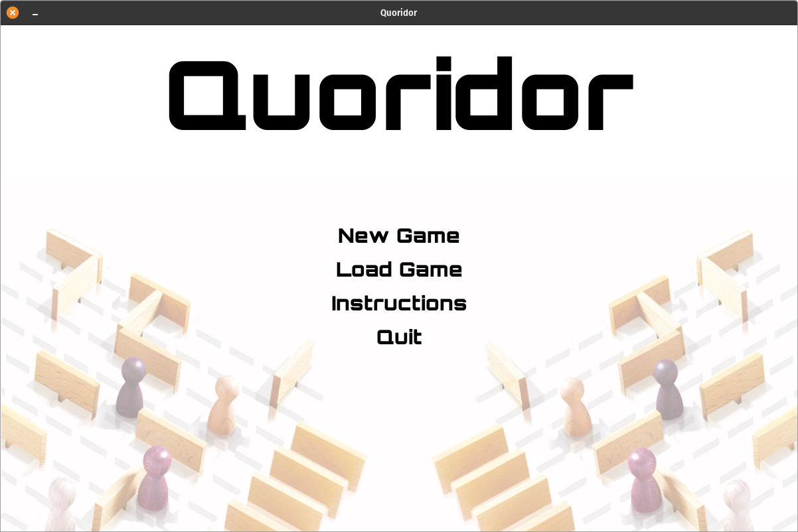
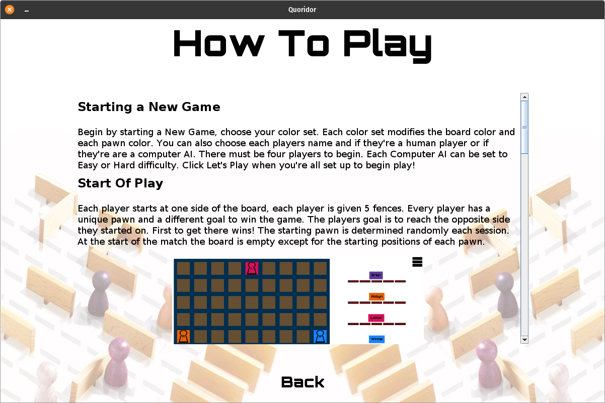
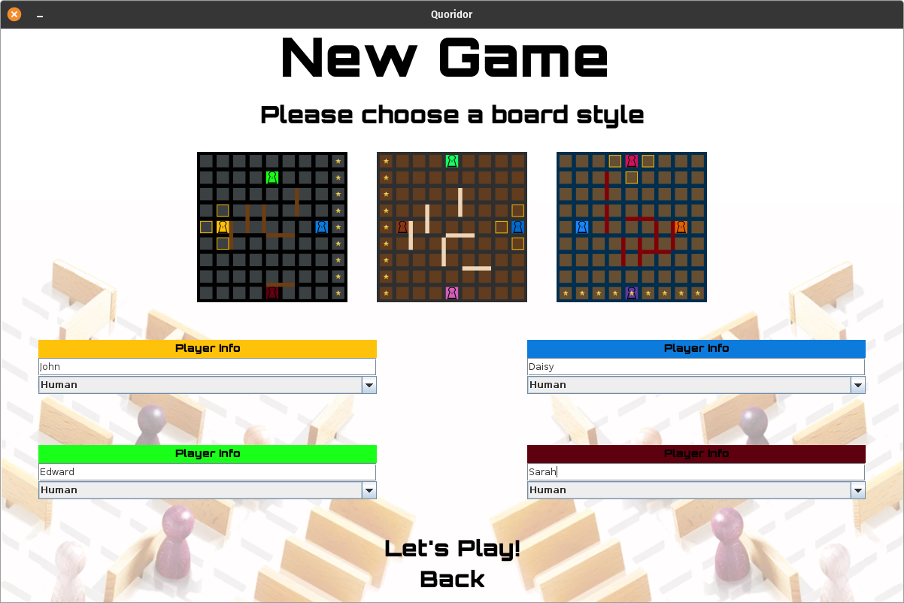
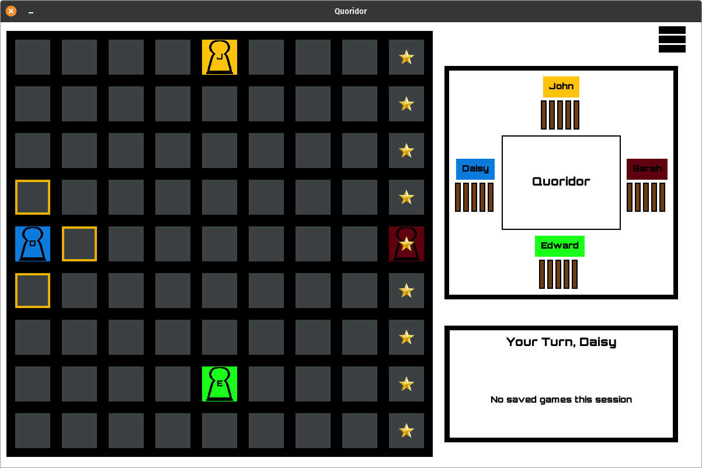
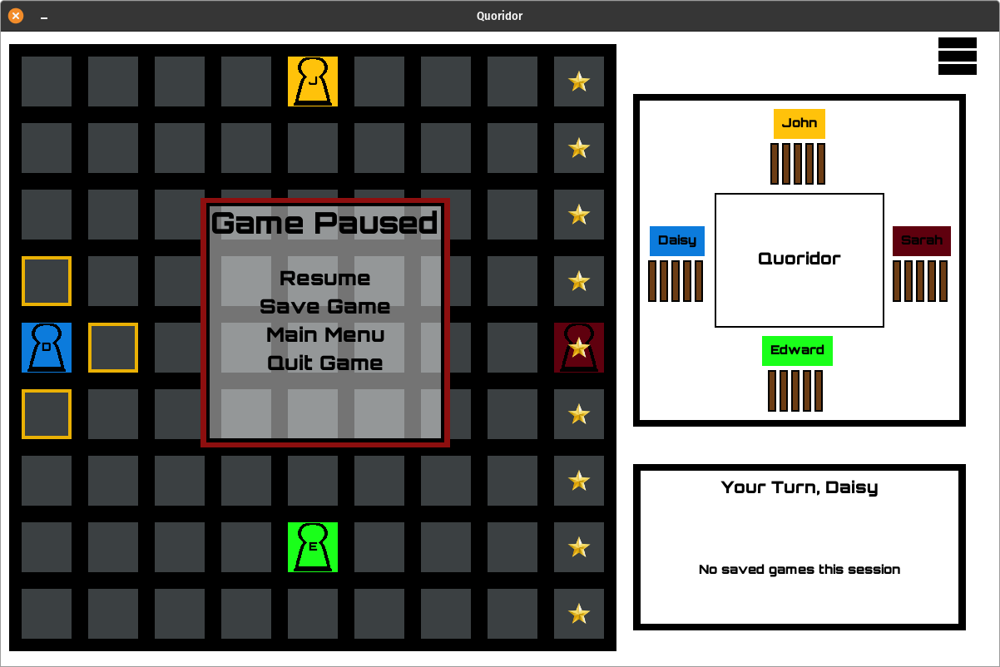
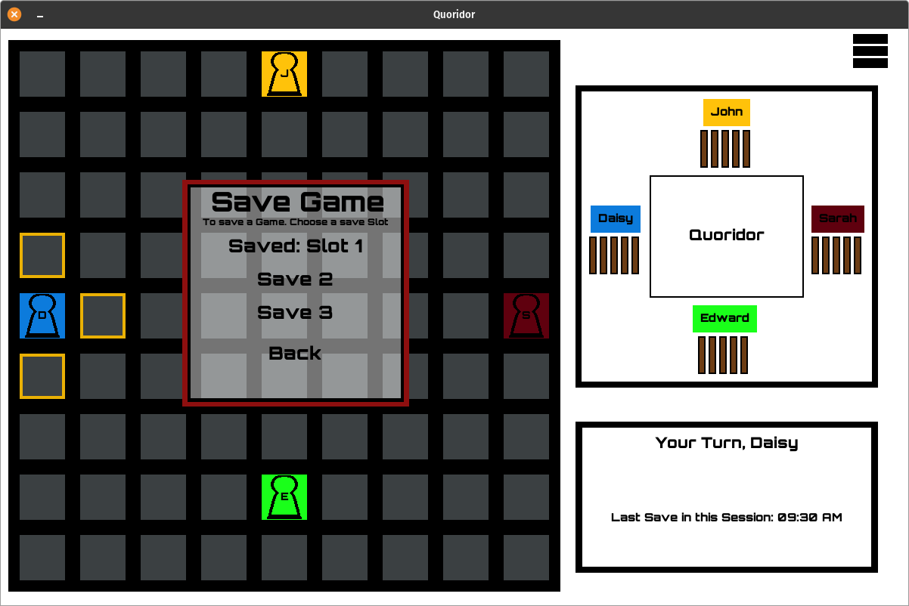
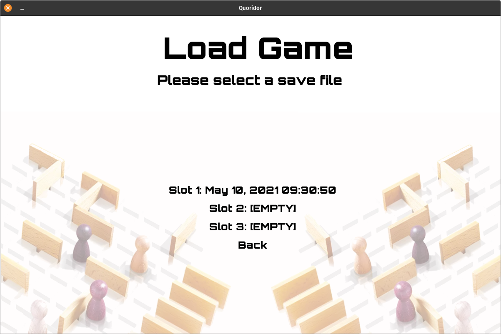

# Quoridor

* Quoridor is a 2 to 4 player abstract strategy game introduced in 1997. The game was designed by [Mirko Marchesi](https://boardgamegeek.com/boardgamedesigner/281/mirko-marchesi).

* The goal of the game is to reach the opposite side of the board from where you started. Along the way your opponent(s) can block your path with walls, walls cover two full blocks in length. This adds a level of strategy to the game.

* All rules can be found in game through the Instructions menu

## Implementation

* This implementation of Quoridor uses Java and it's internal libraries such as `swing` and `java.awt`. The game was designed in an iterative process over ~2.5 months.

* All rules of the game have been implemented including, Computer opponents, wall placements, save/load game, intricate rules such as not blocking a player from leaving any part of the board.

## Running The Game

* Begin by opening your terminal to the `src` directory.

* Compile the Java code, `javac *.java`

* To execute the game run `java Quoridor`

* There is also runnable `.jar` releases in the repository

## Overview
### Main Menu

### Instructions Menu

### New Game Menu

### In Game Menu

### Pause Game Menu

### Save Game Menu

### Load Game Menu

## Acknowledgements

[Quoridor Wiki](https://en.wikipedia.org/wiki/Quoridor)

[Gigamic Games](https://en.gigamic.com/)
